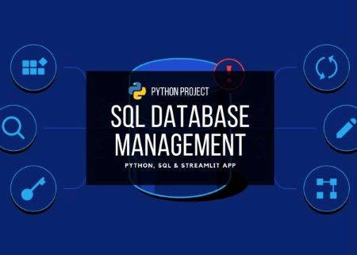

# SQL Database Management

<!---Esses são exemplos. Veja https://shields.io para outras pessoas ou para personalizar este conjunto de escudos. Você pode querer incluir dependências, status do projeto e informações de licença aqui--->

### :speech_balloon: Intro

> Many of the processes and data storage of organizations are still carried out in a very time-consuming way due to their management software.
  The continuous use of Excel spreadsheets can often be the problem that prevents the company's data management process from being optimized.
  One way to avoid this situation is to implement and integrate Python, SQL database, and a Streamlit data visualization framework.

### :rocket: Objectives

> - Develop a tool that builds a database from an Excel spreadsheet.
> - Build ways to optimize the modification, management and analysis of data, automating operations.
> - Automate table formatting and data entry.

## :chart_with_upwards_trend: Results

> - Framework with quick responses and simplified data entry.
> - Secure database with good performance, even with the entry of more than 11 thousand lines of data.
> - Fast data processing for insertion of non-standard spreadsheets during the data entry process.

## :bar_chart: Images

<table>
  <tr>
    <td align="center">
      <a href="image-1.png"">
         
        
          <b>Visualizing data</b>
        
      </a>
    </td>
    <td align="center">
      <a href="image-2.png">
         
        
          <b>Data Analysis</b>
        
      </a>
    </td>
</table>
